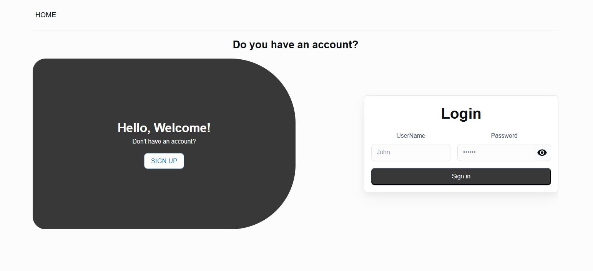

# Task-Zone

A full-featured task management web application with authentication, commenting, and avatar upload. Built with **Next.js + NestJS + MongoDB**.



## Features

- 🔐 User registration & authentication (JWT-based)
- ✅ Full CRUD operations for tasks
- 💬 Add, edit, and delete comments on tasks
- 🖼 Upload a user avatar
- 📁 REST API built with NestJS
- 🌐 UI built with Next.js (App Router)
- ☁️ MongoDB for data storage

## Tech Stack

### Frontend

- [Next.js 14 (App Router)](https://nextjs.org/)
- TypeScript
- TailwindCSS / MUI
- Axios / Redux Toolkit

### Backend

- [NestJS](https://nestjs.com/)
- MongoDB / Mongoose
- JWT authentication (Access Token)
- Multer (for avatar upload)

---

## Project Structure

/task-zone-frontend # Next.js frontend

/task-zone-backend # NestJS backend

## Installation & Setup

### 1. Clone the repository

```bash
git clone https://github.com/AslanovRustam/task-zone.git
cd task-zone
```

### 2. Backend Setup

```bash
.env
DATABASE_URL=''

npm install
npm run start:dev
```

### 3. Frontend Setup

```bash
npm install
npm run dev
```

The app will be available at: http://localhost:3000

### API Endpoints (NestJS)

POST /api/auth/login — Log in

POST /api/users — Add User

GET /api/users/:username — Get user by username

GET /api/users/id/:id — Get user by ID

GET /api/tasks — Get all tasks

GET /api/tasks/user/:userID — Get users tasks

POST /api/tasks — Create task

PATCH /api/tasks/:id — Update task

DELETE /api/tasks/:id — Delete task

POST /api/comments — Add comment

PATCH /api/comments/:id — Edit comment

DELETE /api/comments/:id — Delete comment

POST /api/users/:userID/avatar - add avatar
